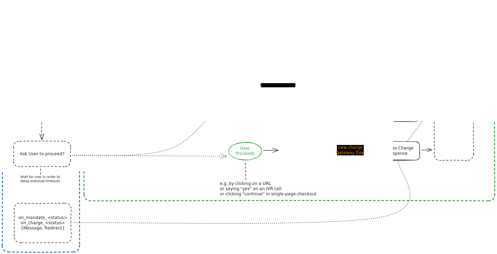

# Architecture

The Payment app provides an abstract payment controller and specific implementations for a growing number of Payment Gateways inside the _Payment Gateways_ module.

An additional _Payment Gateway_ doctype inside the _Payment_ module serves as the generic link target referencing and dispatching to the respective payment gateway controller and settings.

App adds custom fields to Web Form for facilitating payments upon installation and removes them upon uninstallation.

## Relation between RefDoc and Payment Gateway Controller

A reference document implements the surrounding business logic, links to the _Payment Gateway_ and hands over &mdash; typically on submit &mdash; to the specific payment gateway controller for initiating and handling the transaction.
After the transaction has been handled, the reference document may execute post-processing on the result and/or remit a specific payload (e.g. redirect link / success message) to the user via the payment gateway controller.

During the entire lifecycle of a payment, state is maintained on the _Integration Request_ doctype. It allows persisting free-form data and otherwise serves as a central log for interaction with remote systems.

### TX Data and TX Reference

The data is passed from the RefDoc to the Payment Gateway Controller via a standardized data structure called _TX Data_.

Then, all transaction lifecycle state is stored into a _Integration Request_.

The _Name_ of the _Integration Request_ will be the system's unique _TX Reference_.

It is not a payment gateway's _Correlation ID_ (the Sales Order Name could be one), however the _TX Reference_ should be carried in all requestes across the lifecycle to easily identify the transaction in the backend,
for example by using a payment gateway's meta fields. (Use the _Integration Request's_ `request_id` as _Correlation ID_, instead.)

### RefDoc Flow

1. Call the payment gateway controller's `on_refdoc_submit` hook with `tx_data` (for validation)
2. Call the payment gateway controller's `initiate_payment` method with `tx_data` and store the _Integration Request_ name.
3. Call the payment gateway controller's `is_user_flow_initiation_delegated` predicate with `integration_request_name`.
4. If user flow initiation is not delegated (to the payment gateway): initiate/continue user flow, e.g. via Email, SMS, Whataspp, PhoneCall, etc.
5. Postprocess the payment status change via `on_{mandate,charge}_<status>` with a two-fold goal:
   - continue business logic
   - return buisness-logic-specific payload (e.g. message / redirect instructions) to payment gateway controller

### Payment Gateway Controller Flow

The payment gateway controller flow knows the following generic flow variants:

- Charge: a single payment
- Mandate Acquisition: aquire a mandate for present or future mandated charges
- Mandated Charge: a single payment that requires little or no user interaction thanks to a mandate

The distinguising factor is that a mandate representes some sort of pre-authorization for a future (mandated) charge. It can be used in diverse use cases such as:

- Subscription
- SEPA Mandate
- Preauthorized Charge ("hotel booking")
- Tokenized Charge ("one click checkout")

Therefore, the flow needs to decide which route to take, and looks like this:

1. Eventually throw on `on_refdoc_submit` execution, if there's an issue.
2. Decide wether to initiate a Charge, a Mandate Acquisition or a Mandated Charge. Mandate Acquisition is typically implemented as a pre-processing step of a (the first) Mandated Charge.
3. Wait for the user GO signal (e.g. via link, call, sms, click) then `procede`. We delay remote interactions as much as possible in order to:
   - Initialize timeouts as late as possible
   - Offer the customer choices until the last possible moment
4. Initiate the flow via the dedicated method `initiate_{charge,mandated_charge,mandate_acquisition}`.
5. Manage the capturing user flow in collaboration with the payment gateway.
6. Process the result via the dedicated method `process_response_for_{charge,mandated_charge,mandate_acquisition}`.
7. Invoke the RefDoc's `on_payment_{mandate_acquisition,mandated_charge,charge}_processed(<status>)` method and manage the finalization user flow (e.g. via message and redirect).

### Schematic Overview

### And my Payment URL?

The payment URL is simply a well-known concatenation as follows and is one of the alternatives with which the user gives the GO signal to the Payment Gateway controller flow.

It is kept short, tidy and gateway agnostic as a means to impress susccinct trustworthyness on the user.

Format: `https://my.site.tld/checkout?ref=<TX Reference>`.

It is responsibility of `/checkout` to recover `TX Data` and the corresponding gateway controller from the `TX Reference` (from `integration_request_service` field).

## Other folders

All general utils are stored in [utils](payments/utils) directory. The utils are written in [utils.py](payments/utils/utils.py) and then imported into the [`__init__.py`](payments/utils/__init__.py) file for easier importing/namespacing.

[overrides](payments/overrides) directory has all the overrides for overriding standard frappe code. Currently it overrides WebForm DocType controller as well as a WebForm whitelisted method.

[templates](payments/templates) directory has all the payment gateways' custom checkout pages.

