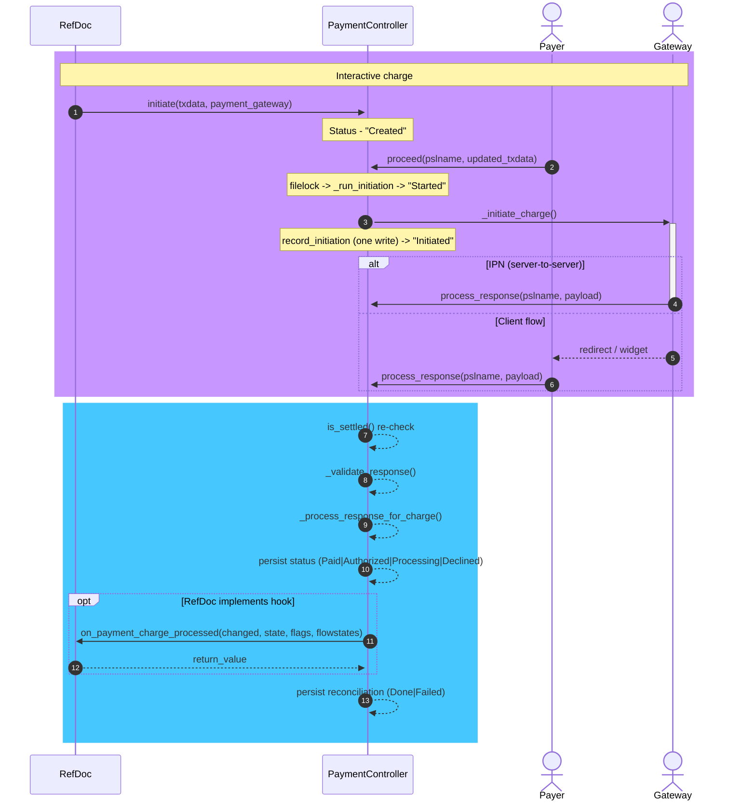

# Architecture

> Adapted from the original architecture notes on `blaggacao/refactor`, from
> which this work descends. This version documents the choices made in **our**
> PaymentController v2: what we kept, what we trimmed, and where we deliberately
> diverged. Differences from the ancestor design are called out inline as
> **[Divergence]**.
>
> **Scope rule for this document:** everything outside the
> "[Designed but not in this PR](#designed-but-not-in-this-pr)" section describes
> code that exists on this branch. If you find a claim here that no symbol backs,
> it is a bug in this file — please fix it rather than implementing to match.

The Payments app provides an abstract _PaymentController_ and specific
implementations for a growing number of gateways. These implementations live in
the _Payment Gateways_ module.

Inside the _Payments_ module, a _Payment Gateway_ DocType serves as the link
target from a reference DocType (RefDoc, see below) to the respective gateway
controller and settings. For example, _Payment Request_ links to a _Payment
Gateway_ to implement its payment flow.

On installation the app adds custom fields to the Web Form (for web-form-based
payments) and a _Payment Session Log_ reference on _Payment Request_, and
removes them on uninstallation. The Payment Request reference is created by its
own idempotent function and also by a patch, because `after_install` alone never
reaches a site that already has the app.

## Relation between RefDoc and Payment Gateway Controller

The reference document implements the surrounding business logic, links to the
_Payment Gateway_, and calls out — typically on submit — to the specific
_PaymentController_ to initiate and handle the transaction.

After a transaction is handled, the RefDoc may post-process the result via one
of the available hook methods and remit a specific payload (e.g. redirect link
or success message) back to the _PaymentController_.

Throughout a payment's lifecycle, state is maintained on the _Payment Session
Log_ (PSL) DocType. It persists free-form data and serves as the central log of
interaction with remote systems.

### TXData, TX Reference and Correlation ID

Data is passed from the RefDoc to the controller via a standardized structure,
_TXData_ (`payments/types.py`), whose fields are `amount`, `currency`,
`reference_doctype`, `reference_docname`, `payer_contact`, `payer_address`,
`loyalty_points` and `discount_amount`. All lifecycle state is then stored on a
_Payment Session Log_.

The **name** of the PSL is the system's unique transaction reference, passed
around between server, client, and remote systems. Gateways should stash it in
request metadata so the remote always returns it, allowing reliable
identification. The payment URL carries it as the `s` query parameter:
`https://my.site.tld/pay?s=<Payment Session Log name>`.

A gateway's _Correlation ID_, when available, is stored as the PSL's
`correlation_id`. If the remote can only echo the correlation id (not the PSL
name), implementations recover the PSL by filtering on
`{"correlation_id": correlation_id}`.

> **Security note on the PSL name.** It doubles as the capability token for
> `/pay`, and it is *not* 10 random characters. Frappe's default hash naming is
> `_get_timestamp_prefix() + _generate_random_string(7)` truncated to 10, where
> the prefix is a function of creation time, so the secret is roughly **30–35
> bits** of base32. A guessed link discloses the payer's name, the amount and
> currency, and the reference document. There is no rate limit on the page. A
> dedicated high-entropy token field is the right fix and is not implemented.

**[Divergence] Security & concurrency hardening.** Our controller adds guards
the ancestor design only gestured at:

- **Tamper whitelist:** at `proceed()`, only `UPDATABLE_TX_DATA_FIELDS`
  (`payer_contact`, `payer_address`, `loyalty_points`, `discount_amount`) may be
  updated from a caller-supplied `updated_tx_data`; critical fields (amount,
  currency, reference doc) cannot be changed. Rejected keys are recorded with
  `frappe.log_error`, so an attempted tamper leaves an Error Log row.
- **PII minimisation:** `payer_contact` and `payer_address` are projected onto
  documented allowlists at the PSL boundary (`_minimize_payer_pii`), so both
  `create_log` and `update_tx_data` are covered — the latter matters because
  those two fields are guest-updatable. **The allowlist has to track its
  producer:** a contact-document producer supplies `first_name`/`last_name` and
  no `full_name`, and omitting those parts made `/pay` render "Customer: None"
  for every session from such an initiator, so both are accepted and `full_name`
  is derived when absent. `email` is deliberately *not* accepted — nothing reads
  `payer_contact["email"]`, and a minimisation allowlist should not keep a second
  copy of the payer's address in a blob a guest page renders. Scope note: the
  ERPNext-side producer this anticipates is **prospective**. There is no
  `_get_contact_fields` in ERPNext v16.30.0 (zero occurrences of it, or of
  `payer_contact`, outside this repo); ERPNext calls
  `controller.get_payment_url(payer_name=..., payer_email=...)`, the v1 shape.
- **Serialised initiation:** `proceed()` runs its guard and the gateway call
  under `frappe.utils.synchronization.filelock`, keyed on the session, so two
  concurrent callers cannot both initiate a charge.
- **Frontend-safe gateway context:** guest templates receive only
  `PaymentController.get_frontend_safe_context()`, an explicit per-gateway
  allowlist, never the raw gateway settings document (which holds secrets).
- **Fail-fast construction:** `PaymentController.__init_subclass__` requires
  every concrete controller to declare `flowstates` and `frontend_defaults`, at
  class-definition time.

## Adding a gateway

A v2 gateway is a DocType controller that subclasses `PaymentController`. The
smallest complete example in the tree is
`payments/payment_gateways/doctype/payment_demo_settings/` — it performs no
network I/O and is what the test suite runs against, so it is worth reading
first.

Declare two class attributes. `__init_subclass__` refuses the class at
definition time if either is missing, so a half-declared controller fails on
import rather than mid-payment:

- `flowstates: SessionStates` — which gateway statuses count as `success`,
  `pre_authorized`, `processing` or `declined`. Anything a gateway can report
  that is in none of these categories is treated as an unmapped status and the
  session becomes `Unresolved`.
- `frontend_defaults: FrontendDefaults` — the CSS/JS/wrapper defaults for the
  checkout page.

Then implement the contracts (see the "Lifecycle hooks" block in
`payment_controller.py`, which is the authoritative list):

| Method | Purpose |
|---|---|
| `validate_tx_data(tx_data)` | throw, with a payer-facing message, if the transaction cannot proceed |
| `_initiate_charge()` | call the gateway; return `Initiated(correlation_id, payload)` |
| `_validate_response()` | check payload integrity, e.g. a signature against a shared secret |
| `_process_response_for_charge()` | map the gateway's status onto `flowstates`; may return a `Processed` to override the default result |
| `_render_failure_message()` | the payer-facing text for a decline |
| `_is_server_to_server()` | whether the response arrives out-of-band (a webhook) rather than through the payer's browser |

Optional overrides: `_patch_tx_data()` (per-gateway rounding or field fixes),
`_pre_data_capture_hook()` (fetch data the capture form needs), and
`is_user_flow_initiation_delegated()` (the reference document, not `/pay`, drives
the payer — e.g. an emailed link).

Never expose the settings document to the checkout page. Whatever the page needs
goes through `get_frontend_safe_context()`, an explicit per-gateway allowlist;
the default is empty, so a new gateway leaks nothing until it opts a field in.

## Payment Session Log state

`status` records **what the gateway did**, and nothing else. Values written by
this branch: `Created`, `Started`, `Initiated`, `Data Capture`, `Paid`,
`Authorized`, `Processing`, `Declined`, `Error`, `Unresolved`. (`Cancelled` is
defined in the maps below but no code on this branch writes it to a PSL — it is
reserved, which also means `SETTLED_STATES` is effectively `{"Paid"}` today.)

Three of those values describe a failure, and they are not interchangeable:

- **`Error`** — initiation failed *before* the gateway was reached. Nothing was
  sent, so nothing was charged and a retry is free: `may_retry_charge()` is true.
  It is the **only** state that is, because it is the only one where no charge
  attempt exists at the gateway.
- **`Unresolved`** — the gateway answered and we could not act on its answer.
  Either its response failed to process, or it reported a status this controller
  does not map, which may well be a success we did not recognise. Money may be
  held, so the session is neither retryable nor disposable — but it is **not**
  settled either, so a later callback we *can* map still resolves it. This is the
  one failure state that needs an operator.
- **`Started` with no initiation payload** — the fingerprint of a request that
  stopped between the gateway call and the recording of its result: a SIGKILL, a
  worker timeout, an evicted container. `Started` is written immediately before
  the call and by nothing else; every in-process failure writes `Error` or
  `Unresolved`, and a session never attempted is `Created`. `proceed()` refuses
  such a session and marks it `Unresolved` rather than charging again — see
  `has_an_unrecorded_attempt()`.

  That refusal is deliberately conservative: a request that died just *before*
  the call cannot be told apart from one that died just *after*, so both are
  refused. Resolving it properly means asking the gateway whether a charge
  exists for the session, which is a per-gateway contract and is not implemented
  here.

Two gateway fields, likewise separated because they answer different questions:
`gateway` is the **initiator's restriction** (which gateway this session must
use, or blank for none) and is never narrowed afterwards; `selected_gateway` is
the **payer's choice**, written by `select_button`. `get_controller()` prefers
the selection and falls back to the restriction. The payer's selection must
never be written into `gateway`: that narrows the restriction to whatever was
clicked first, so "or change payment method" can then only offer that same
button, and a retry after a decline is pinned to the gateway that declined it.

> **A retry after a decline is a NEW session.** `Declined` is not in
> `RETRYABLE_STATES`, and that is not an oversight: a decline is a gateway
> answer, so a charge attempt exists, and this model deliberately keeps
> `Declined` out of `SETTLED_STATES` so a PSP that settles a session it declined
> is not ignored. Both can only hold at once if no second charge is started on
> that log — otherwise two live charges sit behind one session and
> `record_initiation` overwrites the first one's `correlation_id`. So the
> reference document calls `initiate()` again, and each charge owns its own
> spine. `/pay` shows a declined session its result and no chooser, which is
> consistent with that.

`reconciliation` (`Pending` / `Done` / `Failed`, blank when not applicable)
records **what we did about it** — whether the RefDoc hook that performs local
bookkeeping succeeded — with `reconciliation_error` linking the Error Log.

Keeping these apart is load-bearing. A reconciliation failure must never be
written into `status`: it would overwrite the gateway's outcome and destroy the
only record that money moved.

Four sets answer four **independent** questions. They deliberately differ, and
every defect this state model has had came from answering one question with
another's set:

| Predicate | Question | Every consumer |
|---|---|---|
| `is_terminal()` / `TERMINAL_STATES` | Should `/pay` stop showing the flow and show a result? Also the indicator-colour map. | **five**: `get_context` in `pay.py`; `select_button`; *both* error handlers in `process_response` (the inner catch-all and the outer one), which use it to avoid overwriting a recorded gateway outcome; and `_run_initiation`'s refusal to start a new charge on a finished session. The last three are really a different question — "has the gateway said anything yet?" — that it answers only because every terminal state happens to be a gateway outcome |
| `is_settled()` / `SETTLED_STATES` | Can no gateway callback change this outcome again? | **one**: the re-check after taking the lock in `process_response` |
| `is_disposable()` / `DISPOSABLE_STATES` ∪ `ABANDONED_STATES` | May the log be deleted past the retention window? Either the gateway answered, or the session never reached one (`Created`). Requires `reconciliation` to be neither `Failed` nor `Pending`. | **none in production.** `clear_old_logs` re-expresses the condition in SQL and never calls the predicate, so the two are twins that must change together — a test asserts they agree across every status × reconciliation pair |
| `may_retry_charge()` / `RETRYABLE_STATES` | May a **new charge** be started for this session? | **three**: in `_run_initiation`, the idempotency guard that replays a stored payload and the refusal to charge a finished session at all; and in `select_button`, the refusal to switch method once an initiation is recorded |

**Every consumer is listed above, with a count.** Keep both current: a consumer
added without updating this table is how the money path came to be written
against the *display* predicate, which re-charged a paid session. Do not cite
line numbers — they rot on the next edit, and a stale one reads as authority.
After adding a call to any of these predicates, re-count: `git grep -n
"is_terminal()"` and friends, ignoring comments.

Consequences worth knowing:

- `Processing` and `Authorized` are terminal for the page but **not** settled and
  **not** disposable — the gateway still owes an answer, so a later callback is
  accepted and the log is retained.
- `Declined` and `Error` are **not** settled (a late settlement or a webhook
  retry is accepted) but **are** disposable, so declined sessions do not
  accumulate forever. Retention being a separate question is what lets both hold
  at once. They differ on retryability: only `Error` may be charged again in
  place, because only `Error` means the gateway was never reached.
- `Unresolved` shares three of those four answers and differs on the one that
  matters: terminal, not settled, not retryable — and **not** disposable either,
  because the gateway answered and we could not act on it, so money may be held
  and this row is the only trace. It is the only failure state that needs an
  operator.
- A captured payment whose reconciliation failed is never disposable, however
  old — that is exactly the audit trail to keep. Note what this does and does
  not give you: the record is **preserved and discoverable** (the list view
  shows it as "Paid · unreconciled" and filters to `reconciliation=Failed`), but
  it is **not automatically re-driven**. `Paid` is settled, so later callbacks
  short-circuit, and there is no retry action yet. Recovery is manual.

`clear_old_logs` expresses `is_disposable()` in SQL; the two must be kept in
step. It is wired through frappe's log retention rather than `scheduler_events`:
`payments/hooks.py` registers `default_log_clearing_doctypes = {"Payment Session
Log": 90}`, and Log Settings then calls this doctype's own `clear_old_logs(days=…)`
— so our disposability rule is what runs, and the window is configurable per
site through Log Settings.

### Two payload columns, deliberately not shared

- `initiation_response_payload` — the gateway's response to our initiation. This
  is what `proceed()` treats as its **idempotency token**.
- `data_capture_payload` — scratch state fetched by `_pre_data_capture_hook` for
  the capture form.

They look alike, so it is tempting to write both through one setter. Doing that
destroys the idempotency token and lets a page reload charge the payer twice:
each has its own writer, and the code says so at both sites.

## Flow variants

This branch implements one flow:

- **Charge** — a single payment. `SessionType` has exactly one member,
  `charge`.

Mandated charges and mandate acquisition are designed but not present; see
[below](#designed-but-not-in-this-pr).

### What `/pay` renders, and the flag that says so

Four independent things can be true of a non-terminal session, and `pay.py`
states each in its own branch rather than letting `pay.html` derive one from the
negation of the others. Deriving it is what produced two defects in a row: a
payer who had just paid was told no payment method was available, and a payer
with a working gateway widget on screen was told the same.

| context flag | set when | renders |
|---|---|---|
| `render_buttons` | at least one enabled button matches the session's gateway filter | the chooser |
| `render_widget` | a Third-Party-Widget button is selected | the gateway's own widget |
| `render_capture` | a Data Capture button is selected | that button's capture form |
| `no_payment_method` | nothing is selected (or the selection was withdrawn) **and** no enabled button matches | "No payment method is available" |

`no_payment_method` is `False` on the widget branch — the widget *is* a payment
method — and on the capture branch, whose form is likewise the method. It is
`False` on every terminal session, where the result is all that renders.

**A selection only counts while its button is still enabled.** `select_button`
refuses a disabled button, but nothing re-checked it for a session already past
the chooser, so `/pay` went on to call `proceed()` and initiate a real gateway
charge through a disabled button. Disabling one is an operator's kill switch —
for a misconfigured or compromised gateway — so a disabled selection is treated
as withdrawn: the payer gets the chooser back if any other button is enabled,
and the denial if none is. That is a different state from "no *other* button is
enabled", where the payer's own selection still works.

### Out of scope (deliberate)

Offline SEPA Direct Debit (pain.008 XML generated for manual bank upload, with
pain.002 / return-file reconciliation) is **not** modelled as a gateway here. It
has no API and settles asynchronously by batch — a poor fit for the interactive,
signed-response lifecycle — and the consuming app (Verenigingen) already owns a
mature offline-SDD subsystem. The controller earns its keep only for
PSP-mediated flows where there is a real API and a response to process.

## RefDoc Flow

1. Call the controller's `initiate` staticmethod with `tx_data` and optionally a
   pre-selected _Payment Gateway_; store the returned PSL name for reference.
2. If a gateway was pre-selected, call the returned controller's
   `is_user_flow_initiation_delegated(psl_name)`. If `True`, the controller
   takes over the user flow; if `False`, the RefDoc business logic drives the
   next steps.
3. If not delegated: initiate/continue the user flow (email, SMS, link, etc.).
   `/pay` offers the chooser only when an enabled button actually matches the
   session; with none it says so rather than rendering an empty chooser, which
   used to dereference `payment_buttons[0]` and 500 the payer's page — the
   post-install state, since nothing ships a Payment Button.
4. Post-process status changes via the optional RefDoc hook
   `on_payment_charge_processed(changed, state, flags, flowstates)`, with two
   goals:
   - continue business logic in the backend;
   - optionally return `{"message": _("..."), "action": {"href": "...",
     "label": _("...")}}` to the controller (`message` shown to the user;
     `action` rendered as the call-to-action). If nothing is returned, the
     gateway's or app's default is used.

   On decline, `on_payment_failed(message)` is also invoked if present.

   If this hook raises, the gateway outcome in `status` is preserved and the
   failure is recorded in `reconciliation` — see
   [Payment Session Log state](#payment-session-log-state).

> **[Divergence] Hook signature.** The ancestor sketch used
> `on_payment_*_processed(flags, state)`; ours passes
> `(changed, state, flags, flowstates)` so hooks can see whether the status
> actually changed and the controller's full state.

## PaymentController Flow

We delay remote interaction as late as possible — to initialize timeouts late
and keep customer choices open until the last moment.

1. `initiate` throws if `validate_tx_data` rejects the data; otherwise creates
   the PSL (status **Created**).
2. **Interactive charge** — wait for the user GO signal (link, click, SMS), then
   `proceed(psl_name, updated_tx_data)`. The controller may apply whitelisted
   `tx_data` updates from user input.
3. `proceed()` acquires the session `filelock` and delegates to
   `_run_initiation(psl, updated_tx_data)`, which re-reads the idempotency guard
   *inside* the lock, refuses sessions that must not be charged again, applies
   the filtered `tx_data` updates, sets status **Started** immediately before
   the call, calls `_initiate_charge()`, and then records `correlation_id`,
   `flow_type` and the initiation payload in a single write (status
   **Initiated**). The status write sits where it does so that `Started` means
   "the gateway may have been reached"; recording is one write so the session
   never holds a charge without its idempotency token.
4. The actual capture proceeds in collaboration with the gateway (client flow or
   server-to-server).
5. `process_response(psl_name, payload)` recovers the controller and:
   - re-checks `is_settled()` after taking the processing lock;
   - `_validate_response()` checks payload integrity (e.g. signature against a
     shared key);
   - `_process_response_for_charge()` maps the gateway status onto `flowstates`
     (`success` / `pre_authorized` / `processing` / `declined`);
   - the new gateway status is persisted (**Paid** / **Authorized** /
     **Processing** / **Declined**);
   - the optional RefDoc hook runs and may override the user-facing result;
     `reconciliation` records whether it succeeded.

   Anything a gateway hook raises that is not one of the four handled exception
   types is caught, recorded in the Error Log with a traceback, and turned into a
   red `Processed` — moving the session to **Error** only if no gateway outcome
   is recorded yet, so a persisted `Paid` is never overwritten. `frappe.Redirect`
   is deliberately re-raised ahead of that handler, being control flow rather
   than failure. There is a second handler on the outer scope covering the work
   before the hooks run — reloading the session, rebuilding `TxData`, fetching
   the reference document — because a failure there stranded the session at
   **Initiated** with no trace.

### Idempotency

`process_response` is expected to be idempotent: a server-to-server gateway
response and a client-flow signed payload may arrive in parallel. The
`is_settled()` re-check makes a second arrival a no-op that returns the already
settled status.

`proceed()` is idempotent through `initiation_response_payload`: if a gateway
initiation is already held and the session is not `may_retry_charge()`, the
stored payload is returned rather than initiating again. Not "non-terminal",
which is the predicate that fix *replaced* — gating on it let a `Paid` session
re-charge, since `Paid` is display-terminal.

> **Known gaps, so they are not mistaken for guarantees:**
>
> - A charge that the gateway accepted but this app never recorded cannot be
>   resolved automatically: `proceed()` refuses to retry it (see
>   `has_an_unrecorded_attempt()`) and an operator must reconcile against the
>   gateway. The durable fix is a per-gateway "does a charge exist for this
>   session?" query, which no generic controller can implement.
> - Both entry points take the **same** lock (`_session_lock_name`) through
>   `frappe.utils.synchronization.filelock`. That lock is **host-local** — the
>   lock file lives under the site directory — so it does not serialise across
>   app servers or containers. The durable fix is a gateway-side idempotency key
>   (the PSL name is a natural one), which is a per-gateway contract since each
>   PSP names it differently.
> - On lock contention `process_response` logs and re-raises rather than
>   returning a state report, so a gateway resends instead of reading a
>   non-error return as accepted. An interactive refresh landing inside the
>   10-second window therefore sees an error.
> - The `Created` purge bounds retention, **not the rate** at which guest-created
>   sessions arrive. What bounds the rate is the pre-existing `@rate_limit` on
>   `payment_webform.accept` (5/min, keyed on the web form). Adding a v2 guest
>   entry point without a limit would reopen that, and the purge would not save it.
> - Rendering `/pay` performs the initiation: the GET that follows the payer's
>   `select_button` calls `proceed()`. A fresh session with no button selected
>   initiates nothing, so an unfurl bot on the emailed link is harmless, but a
>   GET still carries a state-changing side effect.

### Sequence Diagram

```mermaid
sequenceDiagram
    participant RefDoc
    participant PaymentController
    actor Payer
    actor Gateway
    autonumber

    rect rgb(200, 150, 255)
    Note over RefDoc, Gateway: Interactive charge
    RefDoc->>+PaymentController: initiate(txdata, payment_gateway)
    Note over PaymentController: Status - "Created"
    Payer ->> PaymentController: proceed(pslname, updated_txdata)
    Note over PaymentController: filelock -> _run_initiation -> "Started"
    PaymentController->>+Gateway: _initiate_charge()
    Note over PaymentController: record_initiation (one write) -> "Initiated"
    alt IPN (server-to-server)
        Gateway->>-PaymentController: process_response(pslname, payload)
    else Client flow
        Gateway-->>Payer: redirect / widget
        Payer->>PaymentController: process_response(pslname, payload)
    end
    end

    rect rgb(70, 200, 255)
    PaymentController -->> PaymentController: is_settled() re-check
    PaymentController -->> PaymentController: _validate_response()
    PaymentController -->> PaymentController: _process_response_for_charge()
    PaymentController -->> PaymentController: persist status (Paid|Authorized|Processing|Declined)
    opt RefDoc implements hook
    PaymentController ->> RefDoc: on_payment_charge_processed(changed, state, flags, flowstates)
    RefDoc-->>PaymentController: return_value
    end
    PaymentController -->> PaymentController: persist reconciliation (Done|Failed)
    end
```

> **Notes:**
>
> - A server-to-server gateway response and a signed client-flow payload may
>   occur in parallel; the blue area must therefore be **idempotent**.
> - The gateway status is persisted **before** the RefDoc hook runs, and both
>   error handlers preserve an already-recorded outcome, so a hook failure
>   cannot destroy it.

### The Payment URL

A well-known, short, gateway-agnostic URL with an `s` query parameter. The page
at that URL captures the user's GO signal for the controller flow and renders
terminal results. Kept tidy to convey trustworthiness:
`https://my.site.tld/pay?s=<Payment Session Log name>`.

## Designed but not in this PR

The mandate model below is **design intent, not code on this branch**. No
symbol here exists yet: there is no `PaymentMandate`, no
`payments/controllers/payment_mandate.py`, no `charge_mandate`, no
`_initiate_mandated_charge`, no `TxData.save_mandate` and no
`SessionType.mandate_acquisition`. The implementation lives on the stacked
branch `pr/4-mandate-framework`; this section records the shape it is being
built to so the charge-path design here does not box it out.

A _mandate_ represents a pre-authorization to charge a payer off-session
(subscription, SEPA mandate, pre-authorized "hotel booking", tokenized
"one-click").

Two flows are planned beyond `charge`:

- **Mandated Charge** — an off-session payment requiring little or no user
  interaction thanks to a previously stored mandate.
- **Mandate Acquisition** — acquire a mandate for future mandated charges.

### How a mandate would be born — two paths

| Path | When the mandate becomes usable | Gateways | Flow type |
|------|---------------------------------|----------|-----------|
| **First charge saves the mandate** | on first-charge **success** | Stripe (`setup_future_usage=off_session`), Mollie (`sequenceType: first` → mandate `valid` once the first payment succeeds) | `charge` + a `save_mandate` signal |
| **Direct mandate** | at creation, with **no** charge | GoCardless (mandate-first), Mollie Mandates API (signed SEPA) | `mandate_acquisition` |

**[Divergence] Acquisition-as-side-effect, primary path.** The ancestor design
treats mandate acquisition as a first-class, user-interactive step (often a
pre-step of a mandated charge). The plan is instead to make the primary
acquisition a **side effect of the first charge**, keeping the direct-mandate
path for gateways that need it.

**[Divergence] Headless entry point.** The ancestor funnels every variant
through the user-present `proceed()`, which cannot express a charge with no user
GO signal. The plan adds a trusted, non-whitelisted `charge_mandate(...)` entry
point over the same initiation core, and — where an off-session charge comes
back needing customer action (SCA) — returns a `Processed` whose action points
at `/pay?s=<PSL>` so the *same* session completes through the interactive path.

> The transient gateway "pending mandate" (e.g. Mollie creates a `pending`
> mandate the moment a `first` payment starts, valid only after it succeeds) is
> a gateway internal. The framework would only persist/link a mandate when it
> becomes usable — i.e. on first-charge success — which is identical for Stripe
> and Mollie.

## The v1 / v2 boundary

Both generations declare `get_payment_url`, with incompatible contracts: v1 is an
instance method taking `**kwargs`, v2's is a staticmethod taking a session name.
`is_v2_gateway()` tells them apart, and there are two entry points because the
adaptation is only safe on one side of the trust boundary:

- **`build_checkout_url(payment_gateway, **kwargs)`** — server-side, **not**
  whitelisted. Handles both generations, adapting the v1 call shape onto
  `initiate()` + `get_payment_url(psl_name)` for a v2 gateway. The Web Form
  override calls this.
- **`get_checkout_url(**kwargs)`** — the guest-callable endpoint, v1 only. It
  **refuses** a v2 gateway, because adapting one means creating a Payment
  Session Log — the money spine — from caller-supplied amount, currency and
  reference document. It also resolves the gateway exactly as `develop` does,
  so a guest reaches no gateway through it that they could not reach before.

`build_checkout_url` forwards `payment_gateway` on to v1 controllers, which
Stripe's checkout page requires among its `expected_keys`.

A v2 gateway reached through ERPNext's Payment Request still fails: ERPNext
calls `controller.validate_transaction_currency(...)` unconditionally, five
lines before `get_payment_url`, and `PaymentController` does not declare it.
(It also calls `validate_minimum_transaction_amount`, but behind a `hasattr`
check, so that one's absence is harmless.) The ERPNext-side v2 branch that
routes around this is on `develop` only.

## Other Folders

- `payments/utils` — general utilities in `utils.py`, re-exported via
  `__init__.py` for convenient namespacing.
- `payments/overrides` — overrides of standard Frappe code (currently the
  WebForm controller and a WebForm whitelisted method).
- `payments/templates` — gateway-specific custom checkout pages (v1 gateways).
- `payments/types.py` — types and dataclasses for IDE-assisted integration
  development.
- `payments/exceptions.py` — the app's exceptions.
- `payments/controllers/payment_controller.py` — the controller base class.
- `payments/patches/` — schema/data patches; currently the Payment Request
  reference field for sites that predate it.
- `payments/www/pay.{py,js,css,html}` — the unified checkout page.
- `payments/payment_gateways/doctype/payment_demo_settings/` — a dependency-free
  reference/demo controller that doubles as the framework's test vehicle.

## Relationship to the ancestor design (blaggacao/refactor)

We took blaggacao's design, **trimmed** the speculative mandate surface out of
the code (it is recorded as design intent above and implemented on a stacked
branch), and **hardened** the charge path: tamper whitelist with an observable
rejection, PII minimisation at the PSL boundary, serialised initiation, a
frontend-safe gateway context, fail-fast controller declaration, and a state
model that keeps the gateway's outcome separate from our own bookkeeping.
